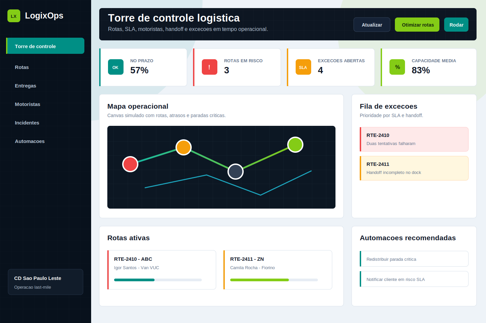

# LogixOps Control Tower

Torre de controle logistica para operacoes last-mile: rotas, entregas, motoristas, SLA, handoff de estoque, incidentes e automacoes operacionais.

Este projeto foi criado para portfolio comercial. A ideia e demonstrar capacidade de construir um sistema de operacao real, com regras de negocio, API, dashboard, simulacoes e dados de exemplo. Nao e um CRUD simples.

## Valor comercial

Empresas de entrega, e-commerce, assistencias tecnicas, distribuidoras e operadores locais precisam reagir rapido a atrasos, falhas de entrega, motoristas sobrecarregados e divergencias de separacao. O LogixOps centraliza:

- rotas ativas com score de risco;
- SLA por ETA, incidentes, capacidade e tentativas;
- entregas criticas sem motorista ou com risco de atraso;
- handoff de estoque por dock;
- fila de excecoes priorizada;
- sugestoes de automacao para dispatch, WMS, cliente e backoffice.

## Preview



## Funcionalidades

- Dashboard responsivo com KPIs operacionais.
- Canvas visual de rotas e risco.
- Quadro de rotas com progresso, ETA, capacidade e motorista.
- Fila de excecoes com prioridade combinada.
- Tabela de entregas com busca e filtros por status/prioridade.
- Simulacao de otimizacao de rota.
- Simulacao de automacoes operacionais.
- API REST com Node.js nativo.
- Testes unitarios e testes de API com `node:test`.
- Dockerfile e instrucoes de deploy.

## Stack

- Node.js nativo
- HTML, CSS e JavaScript puro
- `node:test`
- JSON seed
- Docker

## Como rodar

Requisito: Node.js 20 ou superior.

```bash
npm start
```

Acesse:

```text
http://localhost:3000
```

## Validacao

```bash
npm test
npm run smoke
```

Ou tudo junto:

```bash
npm run validate
```

## Endpoints

### `GET /api/health`

Status do servico.

### `GET /api/summary`

KPIs de operacao: taxa no prazo, rotas ativas, rotas em risco, falhas, entregas sem motorista, incidentes e handoffs pendentes.

### `GET /api/routes`

Rotas enriquecidas com motorista, progresso, pressao de capacidade, score de SLA e entregas vinculadas.

### `GET /api/deliveries`

Lista entregas com filtros:

- `status=all|risco_sla|falha|sem_motorista|em_rota|entregue`
- `priority=all|critica|alta|media|baixa`
- `search=texto`

### `GET /api/exceptions`

Fila de excecoes priorizada por risco operacional.

### `GET /api/automations`

Regras e sugestoes de automacao.

### `POST /api/optimize`

Simula uma redistribuicao de entrega critica para reduzir risco de rota.

### `POST /api/automations/run`

Simula execucao de automacoes.

Body:

```json
{
  "limit": 4
}
```

## Deploy

### Docker

```bash
docker build -t logix-ops-control-tower .
docker run -p 3000:3000 logix-ops-control-tower
```

### Render, Railway, Fly.io ou similar

- Start command: `node src/server.js`
- Porta: usar a variavel `PORT` fornecida pela plataforma.
- O Dockerfile tambem pode ser usado diretamente.

Deploy real nao foi incluido porque depende de conta/credencial configurada na plataforma escolhida.

## Melhorias possiveis

- Persistencia em Postgres.
- WebSocket para atualizacao em tempo real.
- Integracao real com roteirizador.
- Integracao com WMS/TMS.
- Controle de permissoes por perfil.
- Historico de incidentes e auditoria.
- Exportacao CSV/PDF para operacao.
- Notificacoes reais por WhatsApp, SMS ou email.

## Diferenciais para portfolio

- Resolve uma dor operacional plausivel e vendavel.
- Tem varias entidades de negocio conectadas.
- Mostra regras de risco, simulacao de otimizacao e automacao.
- Inclui API, frontend, seed, testes e Docker.
- E facil de explicar em proposta freelance como MVP para controle logistico.
